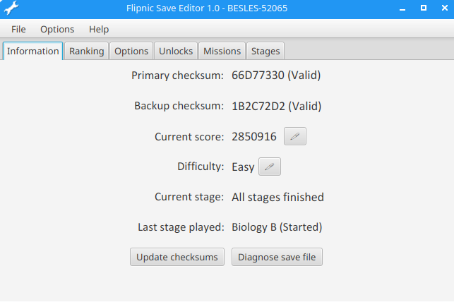
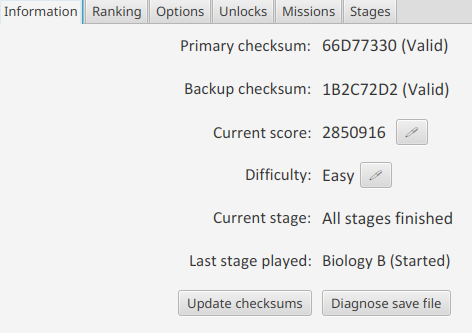

# Flipnic save editor

This tool allows you to edit Flipnic save files as well as partially fix corrupted data by regenerating the checksum.

## Table of contents

* [Locating save file](#locating-the-save-file)
* [Basic operation](#basic-operation)
* [Program features](#program-features)
    * [Quick info about save file](#quick-info-about-save-file)
    * [Viewing and editing ranks](#viewing-and-editing-ranks)
    * [Changing options](#changing-options)
    * [Unlocks](#unlocks)
    * [Mission hacking](#mission-hacking)
    * [Changing stages in original game](#changing-stages-in-original-game)
* [Name fixes (NTSC-J only)](#name-fixes-ntsc-j-only)
* [Creating hybrid saves](#creating-hybrid-saves)
* [Hex pattern file](#hex-pattern-file)

## Locating the save file

Here is a list of known game IDs for Flipnic:

* NTSC-J (Japan): SCPS-15050
* NTSC-U (US): SLUS-21157
* NTSC-U (US Demo): SLUS-29149
* PAL (EU, AU, etc.): SLES-52065

The Flipnic save file is located on the memory card at <GAME_ID>\\<GAME_ID>. Use homebrew such as wLaunchElf to copy this file to a flash drive and then connect it to your computer. At this point, you should be able to open the save file in this save editor.

## Basic operation

You can load a save file in one of the following ways:

1. Drag and drop a save file to the save editor's window
2. File > Open
3. Open a save file with this editor

Before saving the file make sure that the checksums are valid. If they are not valid...

...you must click on "Update checksums" BEFORE attempting to update the save file. If you fail to update checksums and then try to load this modified save file with the game, you'll see this error message:

To save, you can either click **File > Save** or **File > Save as...**.

The difference is that if you choose "Save as", you'll always be asked to specify where to save a file, whereas "Save" will just overwrite the original file.

## Program features

This section lists some of the things that you can do with this save editor.

### Quick info about save file

This lists some info about the save file that you may find interesting. There are also two very important buttons:
* Update checksums - In case any of the checksums are invalid, you can press this button to make them valid again. Attempting to load a save file where any of the checksums are invalid will cause the game to think the save file is corrupt and the game will simply refuse to load it.
* Diagnose save file - If you actually have a corrupted save file, you can press this button to apply common fixes that can help you fix some parts of the save file.

You can also modify some values here by clicking on the pencil button.

### Viewing and editing ranks

Click on the dropdown to select a scoreboard you want to view/edit.

**Double-clicking** a field on the scoreboard will allow you to edit it.

Once you are finished, you can press **ENTER** to confirm changes. Note that you can't edit every field on a row, this includes offset and rank.

### Changing options

You can use this save file editor to change all the various settings you'd normally change in-game.

It may seem useless, but it can actually save you time, because you don't have to navigate through animated menus. Also, this makes a bit more sense once you realize you can use this software to transfer this data to another file.

### Unlocks

You can use this tab to quickly toggle on/off unlocked stages in both original game and free play modes. Pressing "Reset" will only clear unlocks for the selected game type (i.e. original game or free play).

This can be useful if you want to quickly play later stages without having to complete the earlier ones or if you want to re-lock free play stages, as you normally can't do that without creating a new save file. The game normally duplicates the state of original game, but when you use the "retry" option in-game, it only resets the original game unlocks.

You can also force score mode on a specific stage, which allows you to play with score enabled on a previously cleared stage.

### Mission hacking

With the "Missions" tab you can toggle the status of missions (Not complete, Started, Completed), which is something you'd expect to be possible, but there's way more stuff you can modify within the save file that normally isn't possible.

For some reason, the game stores the name table for all the missions within the save file instead of having it be always statically defined in memory. It doesn't actually store string names for the missions, but indicies for all the strings found within the RES.BIN\\JA.MSG file, which is something you can toggle with a dropdown menu like this:

You can also change mission type to something else. Note that this doesn't make it a required mission, since those are defined specifically within the .SST files, it only changes what the mission visually looks like in the "Stage status" menu. For example, let's turn "CIRCLE OF LIFE" into a red mission. This is what it looks like in the stage status menu now:

Another thing you can mess with are "Index" and "Pages" field. Flipnic displays an image if you select one of these missions from the stage status menu, showing you how to complete that specific mission. Well, if you had extracted the files from RES.BIN container, you may notice that there are a ton of .TM2 files within the MISSION\ subdirectory named in a specific way. So, these index values directly dictate to the game which image files to load after selecting a mission from the stage status screen.

The pages value is a bit different. If you have browsed around in the stage status menu, you may have noticed that some missions have multiple images, which you can switch between with the left/right directional pad buttons:

This pages value directly dictates how many subpages a mission in stage status menu should have.

**DISCLAIMER**: Using numbers that don't correspond to any file can cause the game to soft-lock or crash!

You can also change where to get the mission data from. Flipnic stores separate completion tables for original game (default), free play and also for the last played stage.

### Changing stages in original game

I have no idea why this game stores indicies that correspond to the original game stage directories (as defined in RES.BIN\\FNECMN.SST), but apparently that is indeed the case. The "Stages" tab gives you the power to re-order these stages or even assign 2P stages to original game stages. The directory names are internal names, here's what stage they correspond to:

* JUNGLE1 = Biology A
* JUNGLE2 = Biology B
* ISEKI1 = Metallurgy A
* ISEKI2 = Metallurgy B
* HIKARI1 = Optics A
* HIKARI2 = Optics B
* RETRO1 = Geometry A
* BOSS1 = Evolution A
* BOSS2 = Evolution B
* BOSS3 = Evolution C
* BOSS4 = Evolution D
* VS1 = Biology 2P
* VS2 = Metallurgy 2P
* VS3 = Optics 2P
* VS4 = Geometry 2P
* DEMO1 = Unused

# Name fixes (NTSC-J only)

This program should automatically switch to NTSC-J naming scheme (e.g. Theology instead of Evolution) if you import a save file from this region. If it doesn't, you can click on this menu option to enable it:

You may also notice that if you go to missions tab, the names of all the missions are wrong. That's because the original Japanese version uses a slightly different message table and so to fix this, you'd have to import a JA.MSG file from the same menu. This file can be extracted from RES.BIN file using extraction software I've made, including [FlipnicFileTools](https://github.com/MarkusMaal/FlipnicFileTools) and [FlipnicBinExtractor](https://github.com/MarkusMaal/FlipnicBinExtractor) (CLI).

# Creating hybrid saves

You can transfer parts from one save to another creating so-called "hybrid" saves. First open the save file you want the specific section exported from. Then click on one of these menu options:

These menu options correspond to various tabs you see within the save editor. Clicking on one of them will allow you to specify a file name and save location and after clicking "OK", that specific section of the save file will get saved into a separate file that we can import to another save file.

Next we open another save file we want the data transferred to. Then we follow a very similar process, except we click on one of the "Import" menu dropdowns:

You know the import worked if primary and backup checksum become invalid. Simply click on "Update checksums" within the "Information" tab to fix them again.

# Hex pattern file

If you want to manually explore Flipnic save files with a hex editor that supports hexpat files, such as ImHex, you can import the [flipnicsave.hexpat](flipnicsave.hexpat) pattern file to get highlighting for what various bytes within the save file do.

This pattern file is used in the building of this save file editor. There are some bytes we are unsure about, but at least 78% of the save file is documented within this file.
